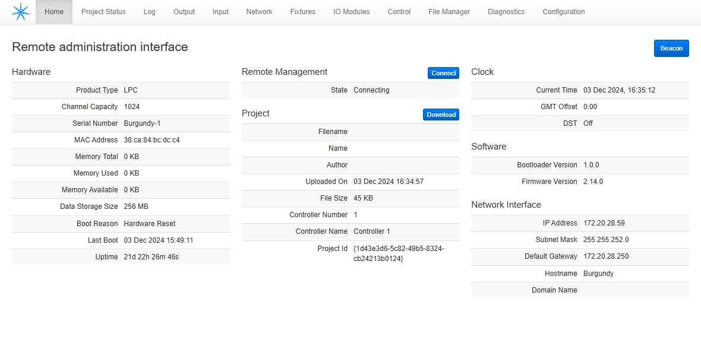
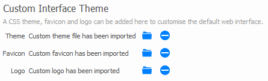
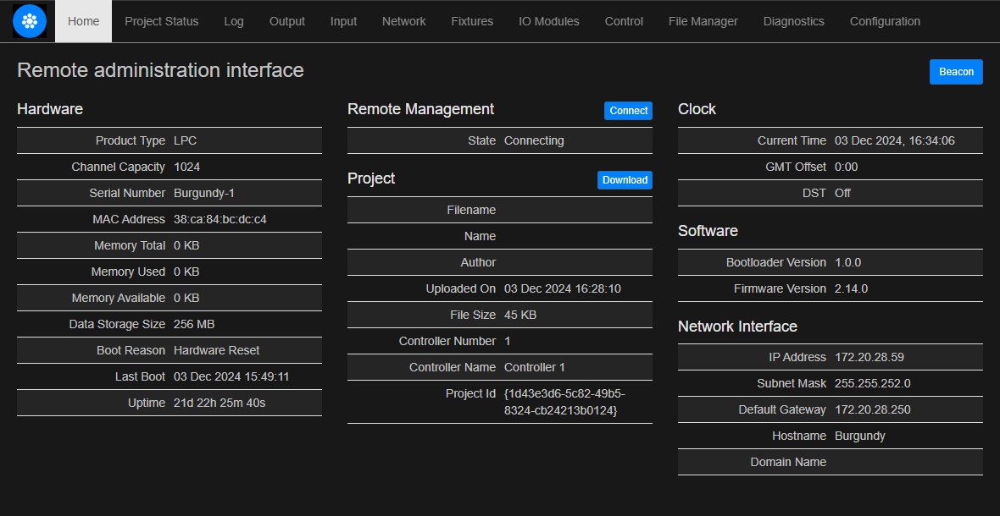

# Overview

The Pharos Web Interface is built into all Pharos Designer controllers and allows the user to access their lighting system for both remote control and troubleshooting. The default style of this interface has been designed using a mostly white, grey and blue colour pallete.

Designer 2 brings a new feature to our standard web interface allowing it to be styled by simply adding your own logo, favicon and CSS files.  We have provided this set of files to not only give you the option of a Dark Theme for your web interface but to also illustrate how you can build your own themes.

Default Web Interface style:

# Included Files
Within the zip file you will find:

## Logo

The file `glyph.png` is the logo that displays in the upper left corner of the web interface pages.  The ideal size for this icon is 128px wide x 128px high when making your own.

## Favicon

The file `favicon.ico` is an alternate favicon using the Designer 2 image.  This icon is used by your browser to associate the web interface page in tabs, bookmarks and favourites.  Favicons are specially generated images that are typically 16px x 16px.  Many online resources exist to convert your image to the favicon style.

## Theme

The file `theme-dark.css` is a new CSS (Cascading Style Sheet) file, which contains the styling information for re-colouring of the web page body, text, buttons and much more. Having a working knowledge of CSS is expected to work with this file or create your own.  However, the style of our web interface is built on Bootstrap v3.3.5 (http://getbootstrap.com).

Bootstrap designed web pages can be easily styled because the organization of all page elements is from a common recipe.  For example:  Changing the default text colour for any bootstrap designed page can be done by simply applying the css style:

    body {
        color: red
    }

Visit the Bootstrap website for tools to create your own themes.

# Adding the files to Designer
From the Project view in Designer 2, select the "Web Interface" horizontal tab. Locate the "Custom Interface Theme" section which looks like this:

Here you will see where the three file types can be added to your project file.  Click on the blue folder to browse to the files on your computer you wish to use.  After you have added the files you desire, simply upload your project to your system and enjoy the new look of the web interface.

New dark theme web interface style:

